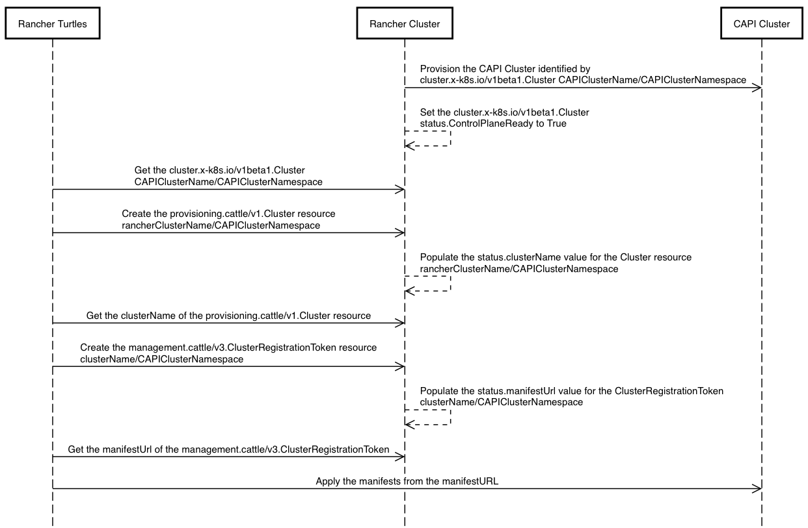

<!-- START doctoc generated TOC please keep comment here to allow auto update -->
<!-- DON'T EDIT THIS SECTION, INSTEAD RE-RUN doctoc TO UPDATE -->

- [7. Cluster Import Strategy](#7-cluster-import-strategy)
  - [Context](#context)
  - [Decision](#decision)
  - [Consequences](#consequences)
  - [Sequence Diagram](#sequence-diagram)

<!-- END doctoc generated TOC please keep comment here to allow auto update -->

# 7. Rancher Namespace Strategy

- Status: proposed
- Date: 2023-16-11
- Authors: @Danil-Grigorev
- Deciders: @richardcase @alexander-demicev @furkatgofurov7 @mjura @salasberryfin

## Context

The feature of Rancher Manager allows you to **import** an existing cluster, however, the resources created for the rancher-turtles to use are spawned across randomly generated namespaces, preventing rancher-turtles from using the namespace scoped permissions for the namespace scoped resources within the Rancher Manager cluster.

## Decision

The operator will take the responsibility of placing Rancher resources in a specific namespace, defined by the CAPI cluster resource namespace.

The namespace will only dictate the designated location of the Rancher Manager cluster resources, such as **provisioning.cattle/v1.Cluster** and **management.cattle/v3.ClusterRegistrationToken**.

## Consequences

To replicate the import steps the operator will need to change the [import strategy][] in steps 1 to 2:

1. Create an instance of the **provisioning.cattle/v1.Cluster** in the Rancher Manager cluster in the selected namespace. Wait for the cluster name to be provided in the status subresource.
1. Create an instance of the **management.cattle/v3.ClusterRegistrationToken** for the cluster name in the selected namespace. Wait for the **ClusterRegistrationToken** status to be populated AND contain an import URL.

The rest of the steps of the [import strategy][] are unchanged.

[import strategy]: ./0006-import-strategy.md#consequences

### Sequence Diagram

