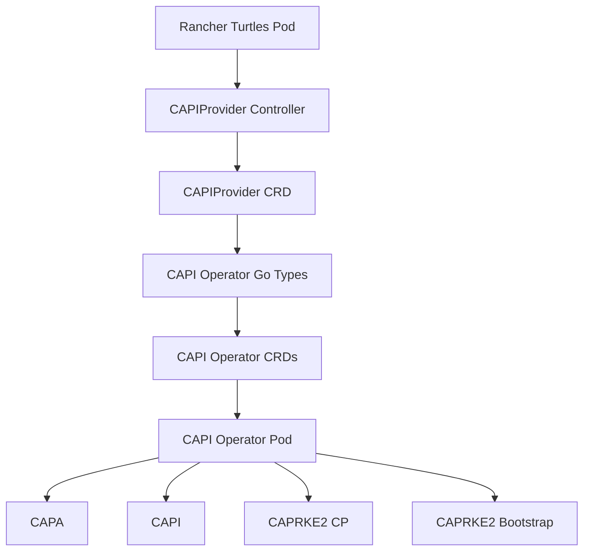
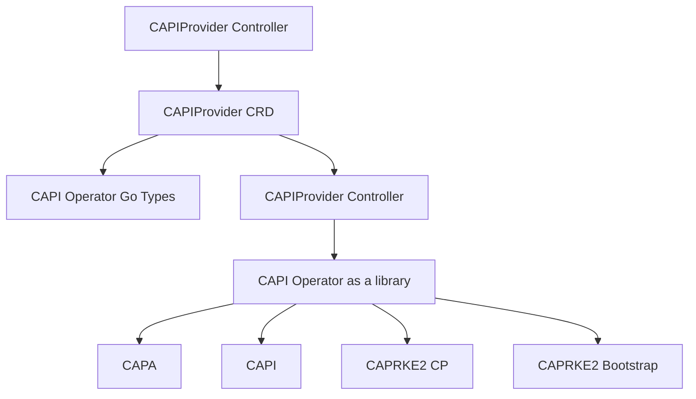

<!-- START doctoc generated TOC please keep comment here to allow auto update -->
<!-- DON'T EDIT THIS SECTION, INSTEAD RE-RUN doctoc TO UPDATE -->

- [15. CAPIProvider Architecture](#title)
  - [Context](#context)
  - [Decision](#decision)
  - [Consequences](#consequences)

<!-- END doctoc generated TOC please keep comment here to allow auto update -->

# CAPIProvider Architecture

- Status: accepted
- Date: 2025-07-10
- Authors: @Danil-Grigorev
- Deciders: @alexander-demicev @furkatgofurov7 @salasberryfin @anmazzotti @mjura @yiannistri

## Context

At the moment, the CAPIProvider API is built on top of the [CAPI Operator project](https://github.com/kubernetes-sigs/cluster-api-operator). The goal of CAPIProvider is to extend CAPI Operator capabilities by providing a better experience for Rancher users, such as having the ability to sync Rancher Cloud credentials or pin provider versions.

The current setup is shown below:

This creates a dependency with the CAPI Operator pod, making Turtles deployment more complex to handle the lifecycle of this extra component and its CRDs.

## Decision

To simplify this, we will stop using CAPI Operator CRDs and controllers. Instead, we will use the CAPI Operator as an embedded library for managing the provider lifecycle after some refactoring of the upstream code. The new setup would look like this:

CAPIProvider would also patch upstream manifests to make them compatible with Rancher's approach to managing webhook certificates by replacing cert-manager with wrangler for environments.

## Consequences

- CAPI Operator can be embedded as a library: https://github.com/kubernetes-sigs/cluster-api-operator/issues/798
- Turtles pod embeds CAPI Operator controllers: https://github.com/rancher/turtles/issues/1395
- CAPIProvider patches manifests to replace cert-manager with wrangler: https://github.com/rancher/turtles/issues/1513
