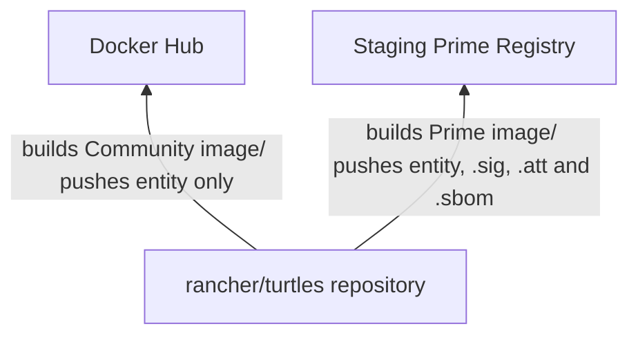

<!-- START doctoc generated TOC please keep comment here to allow auto update -->
<!-- DON'T EDIT THIS SECTION, INSTEAD RE-RUN doctoc TO UPDATE -->

- [17. Release Process](#17-release-process)
  - [Context](#context)
  - [Decision](#decision)
  - [Consequences](#consequences)

<!-- END doctoc generated TOC please keep comment here to allow auto update -->

# 17. Release Process

- Status: proposed
- Date: 2025-09-09
- Authors: @yiannistri
- Deciders: @alexander-demicev @furkatgofurov7 @salasberryfin @anmazzotti @mjura

## Context

As part of making Turtles available as a system chart in Rancher, the release process needs to evolve accordingly. This evolution will be done in 2 phases:
- the intermediate phase, where work in underway to integrate Turtles with Rancher, but Turtles is still being released separately from Rancher.
- the final phase, where Turtles has been integrated and released together with Rancher.

Currently, the release process is fairly simple:
- the release happens on a monthly cadence.
- as part of the release process, a single image is being built, that is used by both community and Prime users.
- the image is being pushed to both ghcr.io as well as the (production) Prime registry.

## Decision

For the intermediate phase:
- a new release process will be introduced which should allow differentiation of community vs Prime builds.
- the existing release process will continue to be used on a monthly basis. This will allow Turtles users to continue to benefit from new releases, while Turtles is being integrated in Rancher. Note however, that the existing release process needs to be updated to push images that are built for Prime, otherwise existing Turtles users may experience differences in features. These images will continue to be pushed to both ghcr.io and the (production) Prime registry.

For the final phase:
- Turtles is released with Rancher.
- upon creating a tag, the release process will produce 2 different container images, one for community users and another one for Prime users.
- the community image will be pushed to DockerHub whereas the Prime image will be pushed to the staging Prime registry.

The following graph shows what happens when a new tag gets created, which triggers a new release:

## Consequences

- Since the community images will be different from the Prime images, we don't need to worry about which versions will become part of the Prime suite. As long as the staging Prime registry has the correct image built for Prime and any associated SLSA artifacts, any of these versions can become part of a Rancher release [using the existing chart release process](https://github.com/rancher/charts/wiki/1%E2%80%90Developing#making-changes-to-packages).
