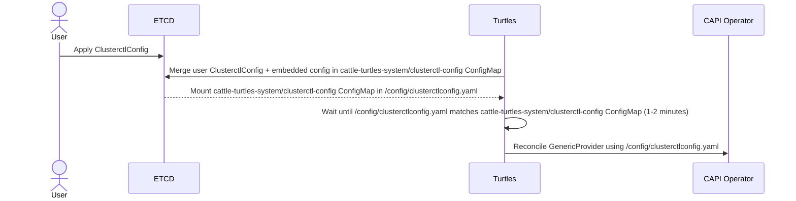
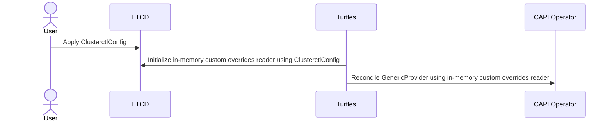

# Removing embedded clusterctl config

## Before

```mermaid
sequenceDiagram
    actor User
    participant ETCD
    participant Turtles
    participant CAPI Operator
    User->>ETCD: Apply ClusterctlConfig
    Turtles->>ETCD: Merge user ClusterctlConfig + embedded config in cattle-turtles-system/clusterctl-config ConfigMap
    ETCD-->>Turtles: Mount cattle-turtles-system/clusterctl-config ConfigMap in /config/clusterctlconfig.yaml
    Turtles->>Turtles: Wait until /config/clusterctlconfig.yaml matches cattle-turtles-system/clusterctl-config ConfigMap (1-2 minutes)
    Turtles->>CAPI Operator: Reconcile GenericProvider using /config/clusterctlconfig.yaml
```

## After

```mermaid
sequenceDiagram
    actor User
    participant ETCD
    participant Turtles
    participant CAPI Operator
    User->>ETCD: Apply ClusterctlConfig
    Turtles->>ETCD: Initialize in-memory custom overrides reader using ClusterctlConfig
    Turtles->>CAPI Operator: Reconcile GenericProvider using in-memory custom overrides reader
```
