# Releasing Rancher Turtles against `rancher/charts` and `rancher/rancher` repositories.

## Important
Before running the workflows, always run the `rancher/charts` workflow first and merge its PR.
Only after the chart Pull Request is merged should you run the `rancher/rancher` workflow.

> Following this order ensures the new Rancher Turtles version exists in charts and prevents broken CI in Rancher.

---

## GitHub workflows

This repository provides GitHub Actions to automate bumping Rancher Turtles versions in `rancher/charts` and `rancher/rancher` repositories.  
These workflows are located in the [.github/workflows](https://github.com/rancher/turtles/tree/main/.github/workflows) directory and include:

- `release-against-charts.yml` – updates the `rancher-turtles` chart in `rancher/charts`.  
- `release-against-rancher.yml` – updates the embedded Turtles version in `rancher/rancher`.  

Both workflows are **manual** and run from the [Actions tab](https://github.com/rancher/turtles/actions).

---

### Release Rancher Turtles against `rancher/charts`

This workflow creates a pull request  in [rancher/charts](https://github.com/rancher/charts) repository to bump the Rancher Turtles version.

> **Note:** Once the GitHub workflow completes successfully, it automatically opens a pull request in the `rancher/charts` repository.

```yaml
Inputs:
charts_ref – Target branch in rancher/charts (e.g. dev-v2.12).
prev_turtles – Previous Rancher Turtles version (e.g. v0.23.0-rc.0).
new_turtles – New Rancher Turtles version (e.g. v0.23.0).
bump_major – Whether to bump the chart’s major version when Turtles’ minor version increases (true/false).
```

**Example:** To release `v0.24.0` after `v0.24.0-rc.0` into the `dev-v2.12` branch of `rancher/charts`, run the workflow with the following inputs:

```yaml
charts_ref: dev-v2.12
prev_turtles: v0.24.0-rc.0
new_turtles: v0.24.0
bump_major: false
```

### Release Rancher Turtles against `rancher/rancher`

This workflow creates a pull request  in [rancher/rancher](https://github.com/rancher/rancher) repository to bump the Rancher Turtles version.

> **Note:** Once the GitHub workflow completes successfully, it automatically opens a pull request in the `rancher/rancher` repository.

```yaml
Inputs:
rancher_ref – Target branch in rancher/rancher (e.g. release/v2.12).
prev_turtles – Previous Rancher Turtles version.
new_turtles – New Rancher Turtles version.
bump_major – Whether to bump the chart’s major version when Turtles’ minor version increases (true/false).
```

**Example:** To update Rancher Turtles from `v0.23.0` to `v0.24.0` in the `release/v2.12` branch of `rancher/rancher`, run the workflow with the following inputs:

```yaml
rancher_ref: release/v2.12
prev_turtles: v0.23.0
new_turtles: v0.24.0
bump_major: true
```

### Release Flow

```mermaid
flowchart LR
    A[🚀 Rancher Turtles release] --> B[⚙️ Run `rancher/charts` workflow]
    B --> C[✅ Merge PR in `rancher/charts`]
    C --> D[⚙️ Run `rancher/rancher` workflow]
    D --> E[✅ Merge PR in `rancher/rancher`]
```



### BackBackport PR Automation

This repository provides a [GitHub Actions workflow](https://github.com/rancher/turtles/actions/workflows/backport-pr.yaml) to automate backporting pull requests to other branches.

> **Purpose:** Create a backport PR for a specific branch (for example, maintenance or release branches) without manually applying patches.

**How to use:**

1. Comment on the original pull request with the following format:

```
/backport <milestone> <target-branch> [<issue-number>]
```

- `<milestone>` – Optional milestone or version tag (e.g., `v2.13.0`).  
- `<target-branch>` – Branch you want the PR backported to (e.g., `release/v0.25`).  
- `<issue-number>` – Optional issue number that this PR should close.

**Example:**

```
/backport v2.13.0 release/v0.25
```

This will create a backport PR with the title:

```
[backport-release/v0.25] Original PR title
```

The workflow automatically:

- Applies the patch from the original PR.  
- Creates a new branch.  
- Pushes the branch and opens a new PR.  
- Assigns any original PR assignees who are members of the organization.

> **Note:** Ensure the branch exists and that you have access to the repository before running the backport command.
